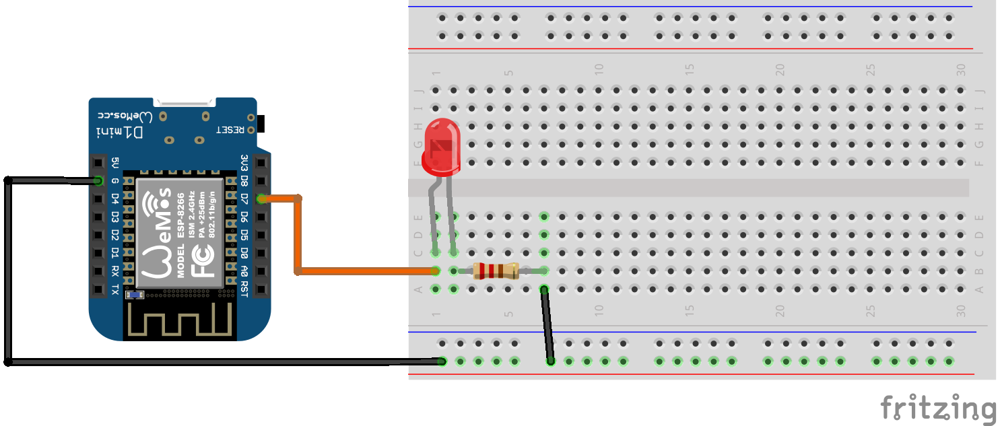

## Hello World! 

Før vi kommer i gang med selve oppgaven, må vi sjekke at alt fungerer, dette gjør vi med å si hallo til verden! Gjør dette med å kopiere koden i `LED_Blink.ino` inn i din Arduino IDE og fullføre koden! 

Du er ferdig når du har fått en lampe til å blinke av og på. 

## NB: HUSK Å KOBLE ARDUINO I PCen! 

## Utstyr for denne oppgaven:
Du trenger:
* [Èn LED lampe](http://a.pragprog.com/magazines/2010-07/images/leds__4z1zpv__.jpg)  (alle fargerer fungerer)
* [Èn 220Ω resistor](https://pandaelectronicsbd.com/wp-content/uploads/2017/07/220-ohm.jpg) 
  * **OBS** Merk deg fargene på resitoren på bildet!  
* [Ledninger (male-to-male)](https://cdn.solarbotics.com/products/photos/03e0f1ccebb02b4dc5cc17e395d3049b/45040-IMG_6236wht.jpg?w=800)

Kretsene burde se ca slik ut: 

## Kode 
For å styre en lampe trenger du: 
* Å fortelle Arduinoen hvilke pin du skal sette strøm på 
* En måte å skru strømmen av og på
* En måte å bestemme hvor lenge du skal ha strømmen av og på 

For dette har vi følgende metdoer. 

* `pinMode(pin, mode)`
* `digitalWrite(pin, mode)`
* `delay(duration)` 

Du kan lese mer om hvordan disse fungerer [her](https://www.arduino.cc/reference/en/language/functions/digital-io/pinmode/)
