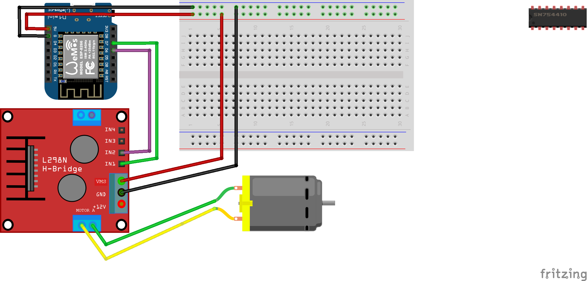

## Spinne motor på kommando

Du har klart denne oppgaven når du har koblet opp servo til et av vinduene på Drivhuset, og åpnet og lukket en persienne med et knappetrykk. 

Kretsen du skal koble opp er lik den du lagde i oppgave 2!

## Koble servo til vindu
Det er mange måter dette kan gjøres på. Vi har veldig mye forskjellig utstyr på Hackerspace som dere kan bruke. En fungerende, men litt gristete og stygg løsning, en sunn blanding av gaffateip og ståltråd. 

## Kode
Som vi har lært er egentlig ikke det å skru av og på et lys veldig forskjellig fra å spinne en motor. Iallfall ikke fra Arduinoen sitt synspunkt. Hvis du kombinerer koden i de forskjellige oppgavene burde du komme frem til noe som fungerer med litt modifisering. 
